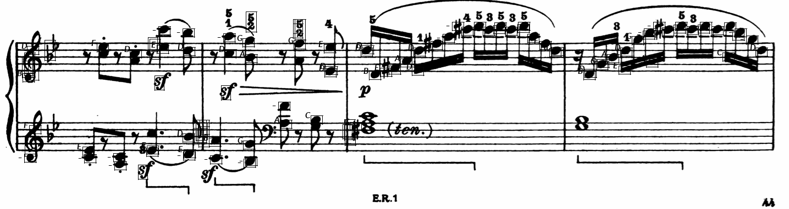

# Optical Music Recognition
Given a PNG Image (portion of a musical score) as input, we need to find the Notes, Quarter Rests and Eighth Rests based on the 3 optical symbols (pre-defined as templates) in the test_images folder using Hough Transform, Naive and Edge Detection Based Template Matching.

## How to Use the Application 

Clone the repository to your machine using the following command

`git clone "https://github.com/ojaashampiholi/Optical_Music_Recognition.git"`

Then change the directory to access the files as follows

`cd Optical_Music_Recognition/`

To test the application on the pre-uploaded images use the following code

`python omr.py "test_images/music_file.png"`

To test the application on the custom images use the following code

`python omr.py "path_to_image/music_file.png"`

## Files and their Overview

### **Main file:** 

-> omr.py - consists of a main method and another method to instantiate the classes in the utility files and to call the relevant methods in the classes

### **Utility files:**

-> Hough_Transform.py - consists of methods to detect and draw the stave lines, to recale the templates, to define the pitch dictionary and to rewrite the output of the OMR system in the desired format 

-> KernelOperations.py - consists of methods to convert the RGB image to grayscale and to convolve the grayscale image with random and Sobel kernels in both separable and inseparable ways

-> Template_Matching.py - consists of methods to perform naive template matching, to perform edge detection based template matching and to draw the bounding boxes around the detected template

### **Input**

-> Name of the input PNG image in the command line argument

### **Output** 

-> detected.png - Image with detected notes along with the pitch (A through G), quarter rests and eighth rests in bounding boxes

-> detected.txt - text file of the format <row> <col> <height> <width> <symbol type> <pitch> <confidence>, 
where row and col are the coordinates of the upper left corner of the bounding box, height and width are the dimensions of the bounding box, box, symbol type is one of the filled note, eighth rest, or quarter rest, pitch is the note letter (A through G) of the note or is an underscore (_) if the symbol is a rest, and confidence is a number that should be high if the program is relatively certain about the detected symbol and low if it is not too sure.

## Design Architecture, Assumptions and Choices 

### **Main file**

The three utlity function files are imported in the main file omr.py. Once the program is run, main method reads name of input music image from command line argument. The input PNG image and all the templates are read. The method getResults() is called and input image, templates along with corresponding template factors are passed to method. 

**getResults()**

Instances of the classes in the three utility files are created in the getResults() method. 

The input image is then converted to numpy array format for further operations followed by multiplying each channel in the RGB image array with specific weights - 0.2989 for red channel, 0.5870 for green channel and 0.1140 for blue channel to obtain the grayscale image using the 'rgbtogray()' method in the kernelOperations class.

Hough transform is then performed on the grayscale image array to detect staves and estimate of the size of note heads because space between stave lines is approximately height of a note head which is then used as a reference for rescaling. 

### **Hough Transform** 

**hough()**

This method takes grayscale image as input. The pixel values lesser than 128 are replaced with 0 while the rest of the pixels are replaced with 1 resulting in Binary Image. Every pixel in this image is scanned and vote dictionary named 'votesDict' is created with each row index as the key (x) and its value is increased by 1 for every pair of (row, height) that has an edge pixel. Eack key value pair in the final 'votesDict' has the row index and the corresponding number of white pixels in that row. The list of rows, i.e the keys with values more than 50% of the column length (y) are then filtered from the dictionary. This filtering is based on the assumption that the staves are parallel, horizontal and continuous lines in the music image that stretches for more than 50% of its columns in the row. Thus, if a row index has more than 50% of continuous white pixels, it can be considered a stave line.

The row indices of the stave lines are in the filtered list l. We know from the theory that there is a fixed space between any two stave lines in a set and this space is the same across the set of staves. To find the space between two stave lines in a set, the difference between the row indices that are not immediately next to each other is determined. This difference gives the space between two stave lines.

Further row coordinate of first stave lines in all sets have to be found. We know that the first row index (or the first entry) in the filtered list l is the row coordinate of the first line in the first set. We already know the space between the lines and the row coordinate of the first line. We loop through all the possible row candidates and see if they lie within 'space x 5' distance of the first row coordinate. If any line is found which is not within this bound, then we can assume that row is the first row for another set of stave lines. We keep checking the list till all of possible row candidates are either rejected or have been exhausted.

Now, the space and the row coordinates of the first stave lines in all sets have been determined using this hough() method, drawLines() method can be used to visualize the predicted staff lines.

**drawLines()**

This method takes in the grayscale image, space and the first row coordinates as the input. For every set of the stave lines, the row coordinates of the next four lines are determined using the first line row coordinate. This is repeated for the other set of first row coordinates. Then, copy image of same shape as our grayscale input is initialized with all zero values and pixel values of all row coordinates found previously are set to 255.

The copy image when viewed in the getResults() method, is a black and white image with only the two sets of stave lines similar to the input music image. This copy image is stored as "detected_staves.png". 

Once after the stave lines are detected, a Pitch Dictionary is created to find the type of pitch. The space and first row coordinates are passed to a method named getPitchDictionary().

**getPitchDictionary()**

This method takes grayscale image, space and first row coordinates as inputs. Types of the pitch from A through G for both the staves, are defined in the pitch dictionary based on the space, i.e the space between any two lines in a stave. This look up dictionary is created for further use.

**resizeTemplate()**

The resize() method is called by passing template image and scaling factor. The second argument passed to this method is space multiplied by a template specific value which are determined as follows. If template to be detected in music image is eighth-rest, then it spans over a length of twice the space between any two stave lines. Thus, template scaling factor should be 2 * space. If template to be detected is quarter-rest, then it spans over approximately a length of thrice the space between any two stave lines. Thus, template scaling factor should be 3 * space. 

The resized template is returned for further use. The resized template is then converted to numpy array and converted to grayscale as we did for the input image for visualization purposes.

All the above steps comprise the preprocessing, after which the omrApplication() method is called. 

**omrApplication()**

Inputs to this method are grayscale input image, resized grayscale template, type of template matching (naive or edge detection based template matching), name of template to be matched in the image (filled_note,quarter_rest or eighth_rest), pitch dictionary, space and arbitrary template specific threshold factor.

### **Template Matching** 

**naiveTemplateMatching()**

In this method, the pixels in the image and the template where the values are greater than 128 are substituted with 1 and others with 0. Threshold is calculated as the product of the confidence interval (passed as input to the method), height and width of the template. A similarity score between the image and the template is calculated using a function given in the question. This score evaluates how similar the region around coordinates (i,j) in image I is to the template. This function needs to be computed for each m×n - pixel neighborhood of the image. When the score is above the the threshold, the score along with the region of the image is added to a list named 'scorArr'.

This scorArr list is subjected to non maximal suppression to avoid duplicate detection of the edges.

**nonMaximalSupression()**

This implementation is inspired from  https://github.com/amusi/Non-Maximum-Suppression/blob/master/nms.py
Here, we consider the method of Intersection over Union (IoU) to determine the overlap between the bounding boxes and then set a upper threshold of 0.5 times the area. When the intersection is above 50%, it is safe to assume that the bounding boxes contain the same object.

The matching regions in the image are returned to the omrApplication() method.

When the type of template matching is edge detection, the template is passed to getEdges() method in the template matching class to detect the edges of the template using sobel operators.

**getEdges()**

In this method, the separable sobel operators are used to find the gradients in the X and Y directions. The square root of the sum of the squares of the X and Y gradients give the edges of the template. Here, the edges which exceed the threshold value are substituted with 255 while others with 0. 

The edges of the template are returned to the omrApplication() method.

Since the type of matching is edge detection, max score here is calculated as the sum of the edges from the getEdges() method. The input image, template and the limiting factor as threshold are passed to the edgeDetectionTemplateMatching() method

**edgeDetectionTemplateMatching()**

In this method, we get the edges for both the image and the template using the getEdges() method. A distance transform matrix 'Dmatrix' is defined for this edge detection. The implementation for the distance transform matrix is inspired from http://www.logarithmic.net/pfh/blog/01185880752.  This method takes the result of the getEdges() method as the input and returns 'D_imageEdge'.

After the distance transform is done for the image edge, threshold is calculated as the sum of the template edge * threshold factor passed as the input to the method. Then, as in the naive matching, a region of the D_imageEdge and the template edge are matched. The region with maximum score is added to the scorArr1 array and non maximal suppression is run on the array. 

The matched regions are then returned to the omrApplication() method.

Once the matching regions are returned from the naive method or edge detection method, the bounding boxes are drawn and the type of the note is determined using the pitch dictionary.The confidence value is calculated as (score/maxscore * 100), where score is the score of the matched region in the image and maxscore is calculated as described above. 

### **Kernel Operations** 

The utility file named kernel operations comprise of various commonly used separable and inseparable kernels to perform convolution on grayscale images for edge detection, blurring etc. 

## Results
### Image 1
**Input Image** 

**Output Image** 

### Image 2
**Input Image** 

**Output Image** 

